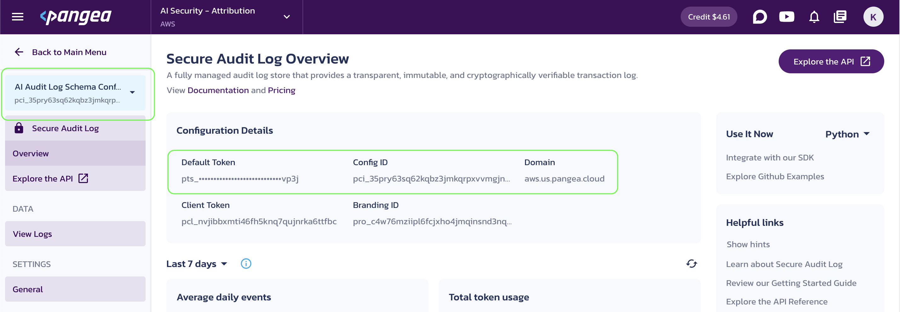
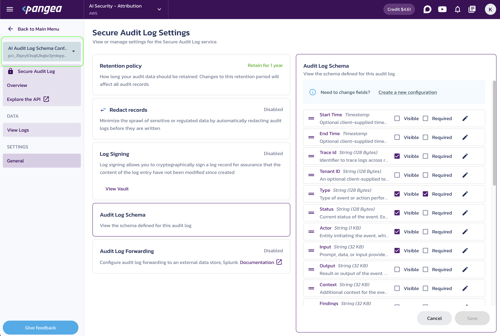

# Attribution and Accountability in LLM Apps with Python, LangChain, and Pangea

> This tutorial is also available on the [Pangea Documentation](https://pangea.cloud/docs/ai-security/langchain-python-attribution) website, where you can learn more about Pangea's services.

This tutorial demonstrates how to integrate audit trail functionality into a Retrieval-Augmented Generation (RAG) application. Using Python, LangChain, and Pangea's Secure Audit Log, you will learn to capture application-specific parameters alongside runtime event data, providing enhanced transparency and accountability in your LangChain app.

In the [LLM Prompt & Response Guardrails in Python with LangChain and Pangea](https://github.com/pangeacyber/langchain-python-inference-guardrails) tutorial, we explained how Pangea's Secure Audit Log can be implemented as a LangChain `Runnable`. This enables seamless integration at any point in a chain or tool to enhance logging and accountability.

In [Identity and Access Management in LLM Apps with Python, LangChain, and Pangea](https://github.com/pangeacyber/langchain-python-rag-iam), we demonstrated how to implement identity and access management in a LangChain Retrieval-Augmented Generation (RAG) application using Pangea's AuthN and AuthZ services. This allows a signed-in user to include additional context, which they are authorized to access, in their requests to an LLM. The custom retriever built in that example has access to both the username and user permissions.

In all cases, the objects created in the examples can accept LangChain [callback handlers](https://python.langchain.com/docs/concepts/callbacks). In this tutorial, we will demonstrate how a custom callback can log application-specific details, such as the username and their entitlements, along with runtime parameters, including but not limited to:

- Vector store
- Embedding model
- Retrieved document data
- LLM name, version, and temperature
- Prompt content
- LLM's response
- System fingerprint
- Number of tokens used

Different events and data related to the same request (referred to as a "run" in LangChain terminology) can be traced using a run ID and the events can be ordered by timestamps provided through LangChain's core tracing functionality.

This enables you to capture a comprehensive context for each request to your AI app and allows you to analyze the logged information so that you can:

- Detect anomalies.
- Reproduce unusual or unwanted app behavior.
- Attribute actions and outcomes.
- Account for misbehavior.

Using Pangea's [Secure Audit Log](https://pangea.cloud/services/secure-audit-log/) for this purpose provides key advantages:

- Centralized, provider-independent, one-stop location for all your applications' logs
- Tamper-proof audit trail to meet compliance requirements
- Multi-dimensional log storage, allowing different applications and use cases to be managed through separate projects and audit log schemas within a single Pangea account

In this tutorial, you will learn how to capture event data during user interactions with your Python LangChain app using Pangea's [Secure Audit Log](https://pangea.cloud/services/secure-audit-log/). We will use a custom [tracer](https://python.langchain.com/api_reference/core/tracers.html) to capture the application and the runtime event data at specified points during inference in an example Retrieval-Augmented Generation (RAG) application.

## Prerequisites

Skip any prerequisites you’ve already completed.

### Python

- Python v3.12 or greater.
- Pip v24 or greater.

### OpenAI API key

We will use OpenAI models. Get your <ExternalLink to="https://platform.openai.com/api-keys">OpenAI API key</ExternalLink> to run the examples.

Save your key in a `.env` file, for example:

```bash title=".env file"
# OpenAI
OPENAI_API_KEY="sk-proj-54bgCI...vG0g1M-GWlU99...3Prt1j-V1-4r0MOL...X6GMA"
```

### Free Pangea account and Secure Audit Log service

1. Sign up for a free [Pangea account](https://pangea.cloud/signup).
1. After creating your account and first project, click **Skip** to bypass the **Use cases** wizard. This will take you to the Pangea User Console, where you can enable the service.
1. Click **Secure Audit Log** in the left-hand sidebar.
1. Click **Next** in the **Step 1 of 3** dialog.
1. In the **Step 2 of 3** dialog, select **AI Audit Log Schema** from the **Schema Template** drop-down and click **Next**.
1. Click **Done** in the **Step 3 of 3** dialog. This will take you to the service page in the Pangea User Console.
1. On the **Secure Audit Log Overview** page, capture the following **Configuration Details** by clicking on the corresponding tiles:

   - **Default Token** - API access token for the service endpoints.
   - **Config ID** - Configuration identifier for the currently selected configuration.
     Secure Audit Log allows multiple configurations, and if a token has access to more than one, you need to specify a configuration ID in requests to the service APIs. To reduce code maintenance and minimize the risk of unexpected results, it is a good practice to always include the Config ID in your API requests.
   - **Domain** - Domain that identifies the cloud provider and is shared across all services in a Pangea project.
   <figure>
     
     <figcaption>Secure Audit Log Overview</figcaption>
   </figure>

1. Assign these values to environment variables, for example:

   ```bash title=".env file"
   # OpenAI
   OPENAI_API_KEY="sk-proj-54bgCI...vG0g1M-GWlU99...3Prt1j-V1-4r0MOL...X6GMA"

   # Pangea
   PANGEA_DOMAIN="aws.us.pangea.cloud"
   PANGEA_AUDIT_TOKEN="pts_qbzbij...ajvp3j"
   PANGEA_AUDIT_CONFIG_ID="pci_35pry6...gjnpyt"
   ```

We will use the default **AI Audit Log Schema** configuration, but you can inspect, modify, or create a new **Audit Log Schema** under the service [General](https://console.pangea.cloud/service/audit/settings) settings in your Pangea User Console to suit the log data for your use case.

<figure>
  
  <figcaption>Secure Audit Log Schema</figcaption>
</figure>

For additional details about configuring the service, see [Secure Audit Log documentation](https://pangea.cloud/docs/audit/getting-started/configuration).

## Setup

1. Clone this repository.

   ```bash title="Create project folder"
   git clone https://github.com/pangeacyber/langchain-python-attribution.git
   cd langchain-python-attribution
   ```

1. Create and activate a Python virtual environment in your project folder. For example:

   ```bash title="Set Python environment"
   python -m venv .venv
   source .venv/bin/activate
   ```

1. Install the required packages.

   ```bash title="Install dependencies"
   pip install -r requirements.txt
   ```

   > You can also try the latest package versions:
   >
   > ```bash title="Install and update dependencies"
   > pip install --upgrade pip langchain langchain-openai python-dotenv pangea-sdk
   > ```

1. Open the provided Jupyter notebook, [langchain-python-attribution.ipynb](langchain-python-attribution.ipynb), and run the code examples in your Python environment.

   [Jupyter notebooks](https://jupyter.org/) provide a popular way to execute Python code interactively. You can [install Jupyter](https://jupyter.org/install) on your system or use an IDE extension.

   > Be sure to select the kernel in your local `.venv` environment if it is not automatically set by your IDE.
